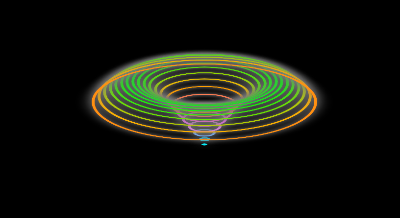

# Efeito água viva
Este é um código css simples tirado de um video do youtube que estou usando para criar videos para o tiktok, estou testando conteúdos por lá e como css tem um poder visual muito grande, 
esse formato de vídeo geralmente da certo.

